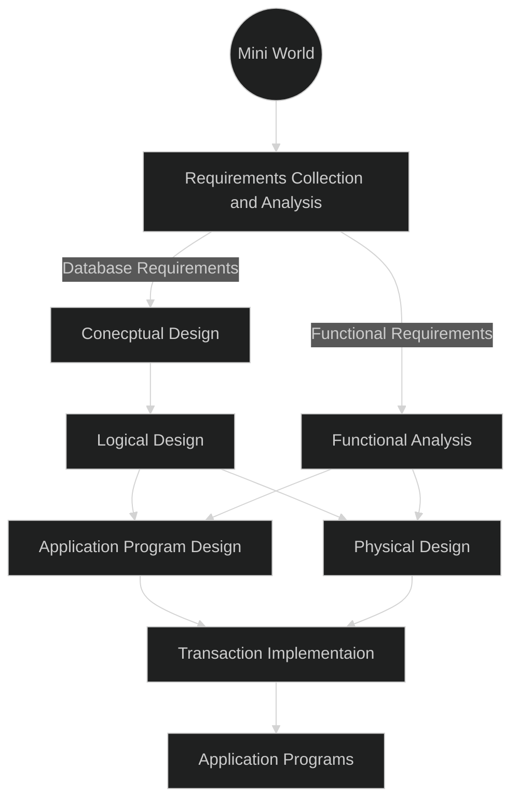
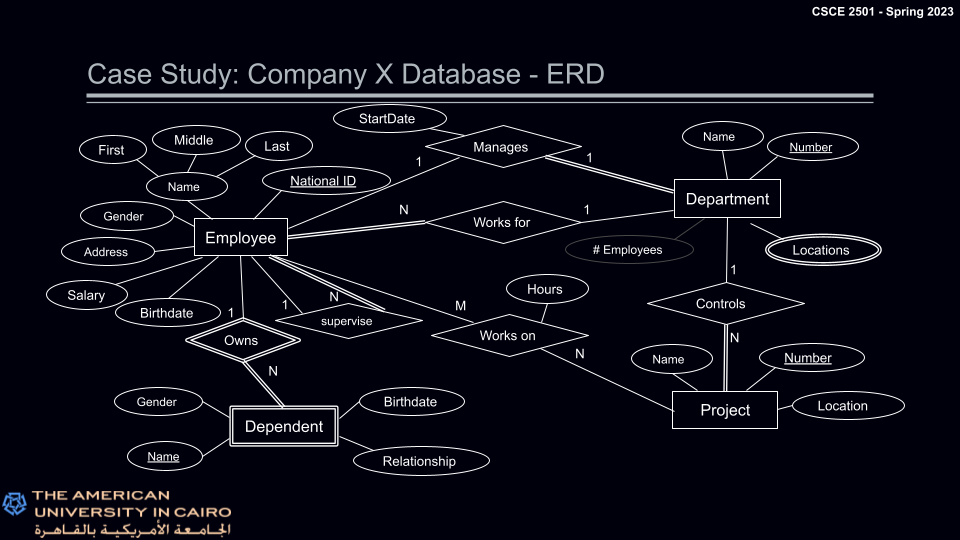
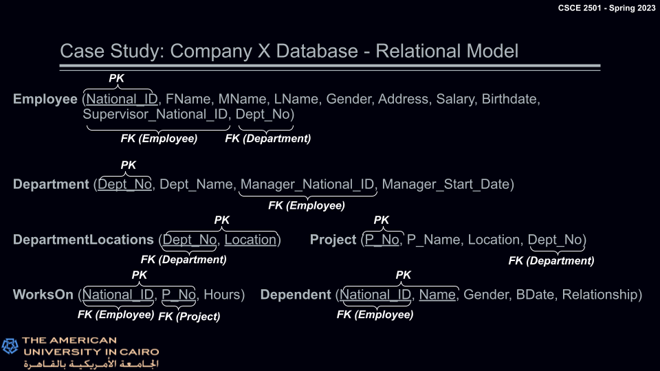

# Fundamentals of Database Systems

[TOC]

# Important
Many of the diagrams and information here have been extracted from
- “Database Systems”, by R. ElMasri and S. Navathe, Pearson Higher Education, 6th edition
- Dr. Hossam Sharara's Slides for the CSCE 2501 : The American University in Cairo

# Introduction
### Data vs Information
Data usually refers to raw data, while information refers to data after it has been processed, organized and presented. For example, temperature at a given time is "data," while a graph representing the change in temperature is information.

### Database systems
A database can be regarded as a large collection of related data. It typically models information about a real-world system.

The need for database systems resulted from the following
- Datafication, which can be defined as the technological trend to translate all aspects of life into data.
- Normal data storage methods are insecure, and have poor performance. 

Mainly, a database consists of
- Entities (objects)
- Relationships (Relations between entities)
- Constraints (Rules on relationships)

For example, in a university, a student (entity) takes (relationship) a course (entity) that has a maximum capacity (constraint).

# Data Classification
Data can be classified into three categories according to its *structure*
- Structured data
	- When data follows a strict, consistent structure; can generally be represented as a table.
- Semi-structured data
	- When data follows some structure, but it is not strict; Different data points might have some data fields and not all of them.
- Unstructured data
	- When data does not follow any form of structure.

# Data Modeling and Abstraction
Structured data is by far the most successful when it comes to storing and operating on as their structure can be exploited for efficiency and ease of use.

### Data Modeling
- A collection of concepts that describe how the data is represented/accessed
	- Entity-Relationship model
	- Object-oriented model
	- Resource description framework
- Different models vary between desriptive power and ease of use (More descriptive usually means harder to use)
- Allows for reasoning about the data at a high level (isn't this abstraction?)

#### Schema
- A description of a specific collection of data using a data model.
- A database is an instance of its schema.
- A schema is not expected to change after the design phase is over.

### Data Abstraction
- Layering the system into different levels of details
- Helps isolate the users from lower level details

#### Data independence
- Applications and users are insulated from the structure of the data
- Allows for changing data structures and schema at one level without affecting any higher levels (What does that mean?)

### Database Management System
A database management system is a software designed to store, manage, and facilitate access to databases.

  

It facilitates the process of defining, constructing, and manipulating databases for various applications and guarantees correctness in the presence of failures, concurrency in data access, and data semantics.
- Data Definition Language (DDl)
	- Defining and modifying database schema
- Data Manipulation Language (DMl)
	- Retrieving, modifying, and analyzing the data itself.

# Entity-Relationship (ER) Model

The ER data model is a set of techniques used for higher level (conceptual) design and representation of
- Different entities 
- Relationships between the entities

## Attributes
A set of properties that describe an entity
- Simple vs. Composite
	- Simple (atomic) : cannot be broken down further
	- Composite: Can be broken down into smaller sub-parts
- Single-valued vs. Multi-valued
	- Single: Each entity can have at most one value
	- Multi: Each entity can have more than one value
- Stored vs. Derived
	- Stored: Must be stored in the data (cannot be inferred from other information)
	- Derived: Can be computed from other attributes (e.g. age from DOB)
- Null-valued 
	- The value of an attribute is not stored nor can be derived
	- A null value will not be used in any computation
- Key Attribute
	- Used to uniquely identify entities of some type; accordingly, its values are distinct.

If a given entity type does not have a key attribute, it is called a weak type.

**Avoid creating new IDs for types that have natural IDs: For example, use National ID instead of Student ID, or Bank Account Number.**

## Relationships
- What is a relationship?
	- Defines an association between two or more entities
	- Refers to an instance between objects
	- Might have one or more attributes
	- Might include more than two entities
	- **Degree** of a relationship is the number of participating entity type (Not the same as [degree of relation](#degree-relation))
	

- Most common *cardinality* ratios for binary relationships
	- 1:1 (one to one) One person can only have one spouse
	- 1:N (one to many) One person can have more than one child
	- M:N (many to many) many people can be relatives of many people

- Participation Constraint
	- Partial (Does not have to participate)
	- Total (All entities have to participate)
	
	Participation constraints can be associated with a structural constraint, specifying min/max number of entities that can exist in the relationship.
- Recursive Relationship
	Between two different entities of the same type.

	Roles should be added to each participating entity so signify the roles each entity plays. For example, a supervisor employee has a supervision relationship with a supervised employee.
	
- Identifying Relationships
	Weak entity types are identifies by being related to a strong entity in combination with some of their attributes.

## ER Diagram notation
**Total relations are represented by two adjacent lines**

# Relational Data Model
First introduced in 1970 by Codd, Relational Data Model (RDM) is based on a very simple and uniform data structure; the relation (table)

In this model a database is represented as a collection of relations.

Each relation contains
- a collection of tuples (rows)
- a set of attributes (columns).

*Degree* of a relation is the number of attributes. (Not the same as [degree of relationship](#degree-relationship))

*Domain* of an attribute is all the possible values an entity can have

*Primary Key* is the unique identifier for the relation. It can be a single attribute or a collection of attributes.

## Properties of Relations
- There cannot exist duplicate tuples (rows) in a relation
- Tuples in relations are unordered (meaning there is no 1st, 2nd,..., or nth tuple, there is only n tuples)
- Attributes in a relation are unordered
- Attribute values are all atomic (single-valued)

## ERD &#8594; RDM
- Entities are converted directly into relations with the same set of attributes
- Multivalued attributes are split into separate relation/entity with a primary key consisting of the attribute itself and the primary key of the main entity.
- Weak entities are represented as either a composite attribute in the "owning" relation or as a separate relation with the primary key copied from the owning relation.
- Relationships are converted into relations with attributes composed of the primary keys of the associated entities and the attributes of the relationship itself.
- One-to-many relationships can be represented by including the primary key of the one relation into the attributes of the many relation &#8594; Foreign key.
- One-to-one relationships can be represented by including the primary key of any of the relations into the attributes of the other relation.

## Relational Integrity Constraints
Ensure that all the data stored in the database is accurate and consistent

There are two types of Integrity Constraints
- Specific Integrity Constraints
	- Applies to a specific database to enforce the data requirements
- General Integrity Constraints
	- Apply to all relational databases in any RDBMS
	- There are two types of general integrity constraints
		- Entity Integrity Constraint &#8594; [Primary Key](#entity-integrity-constraint)
		- Referential Integrity Constraint &#8594; [Foreign Key](#referential-integrity-constraint)

## Entity Integrity Constraint
A primary key is a key used to uniquely identify every tuple in a given relation.
- Candidate Keys are the set of single attributes that could be primary keys.
- Properties of candidate keys
	- Unique: No two tuples in the target should have the same value of the candidate
	- Minimal: If the candidate consists of multiple attributes, then it must be the case that removing any attributes will violate the uniqueness constraint.
The primary key is chosen from the set of candidate keys.

No component of the primary key of any base relation is allowed to have a Null value. Following from the fact that the primary key is used to identify tuples in a relation, if the primary key is allowed to have null values, the corresponding tuples are unidentifiable.

## Referential Integrity Constraint
A foreign key is an attribute that is added to the relational model to represent a relationship between two relations.
- Properties of foreign keys
	- Each value can be wholly null or wholly non-null
	- There exists a base relation with a primary key such that each non-null value of the foreign key is identical to the value of the primary key of some tuple in the base relation
	- The foreign key and the corresponding primary key must be defined on the same domain
	- Foreign keys can accept nulls in partial relationships

- No unmatched foreign key values are allowed in a database.
- For non-null foreign key values, there should always be a matching value in the primary key values in the target relation
- No tuple should reference another tuple that doesn’t exist in the target relation

